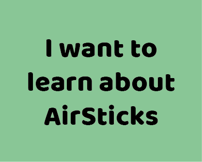
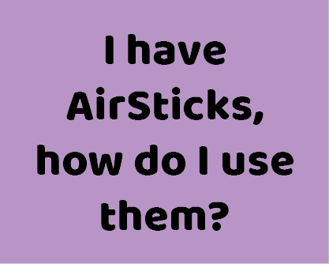
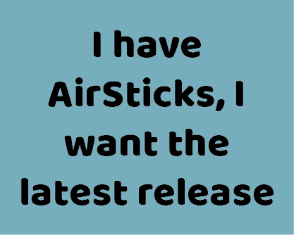

# AirWiki
Welcome to the AirWiki. This site is a knowledge hub for all things AirSticks.

## Click an image to get started...

<a href="HowToGet.md">

 Start your AirSticks journey
</a>

<a href="Learn.md">

 About the project
</a>

<a href="HowToUse.md">

 Setup, software and more
</a>

<a href="LatestReleases.md">

 Quick downloads
</a>

## ...or explore below
