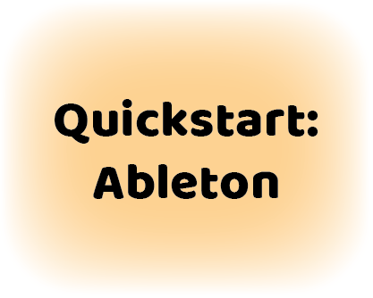
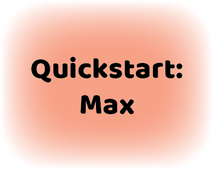
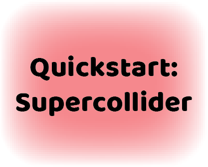

# AirSticks Hub
Welcome to the AirSticks wiki! This site is a knowledge hub for all things AirSticks.

## Get started...

## ...or use one of our Quickstart guides

## Recent work

## Our research

## Our team

